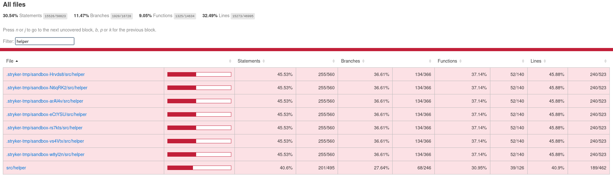

# Coverage Report

## Загальне покриття
- Statements/Instructions: 30.54%
- Branches: 11.47%
- Functions/Methods: 9.05%
- Lines: 32.49%

## Аналіз
- Які функції/класи покриті найкраще?
  - `src/helper/getHref.js` — повністю покритий.
  - `src/helper/search.js` — повністю покритий.
- Які потребують додаткових тестів?
  - `src/i18n.js` — поки немає тестів на конфігурацію i18next, обробку помилок завантаження перекладів і поведінку `init`.
  - `src/constants/translationLabels/common.js` — варто додатково перевірити, що ключі перекладів використовуються коректно.
  - `src/constants/common.js` — потрібні тести для константи `GROUPED` та логіки пошуку по групованню.
  - `src/helper/setLink.js` — схожий файл з логікою створення посилань, який може впливати на поведінку `getHref`.
- Чому деякі branches не покриті?
  - Для файлів `getHref.js` та `search.js` в цьому звіті всі гілки покриті.
## Скріншот

